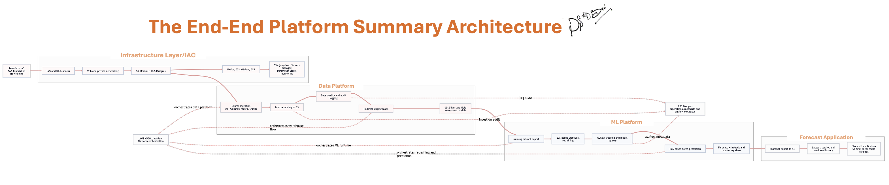
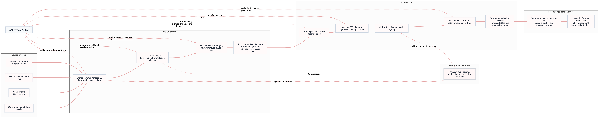
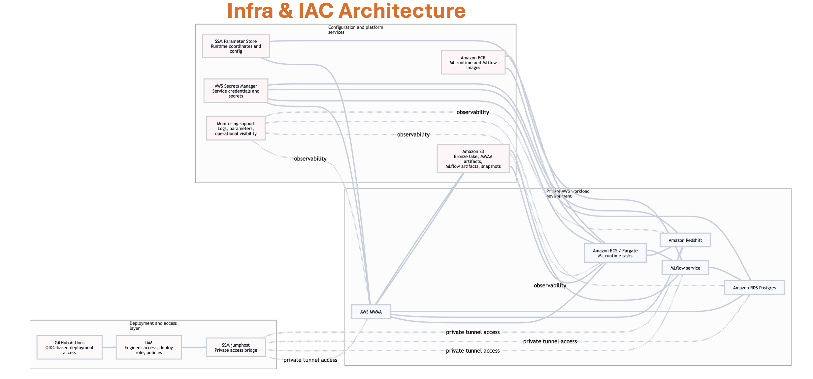
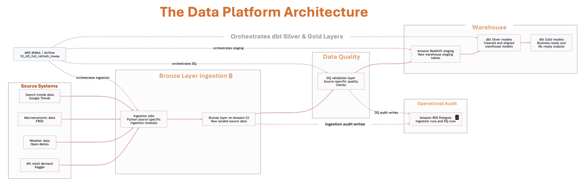
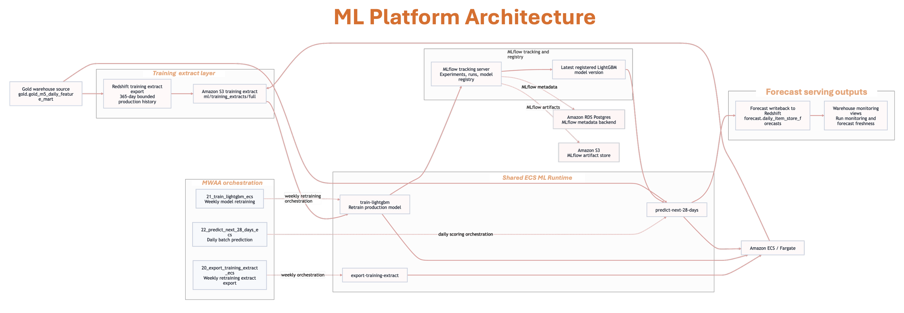
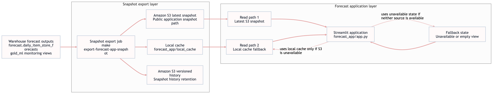
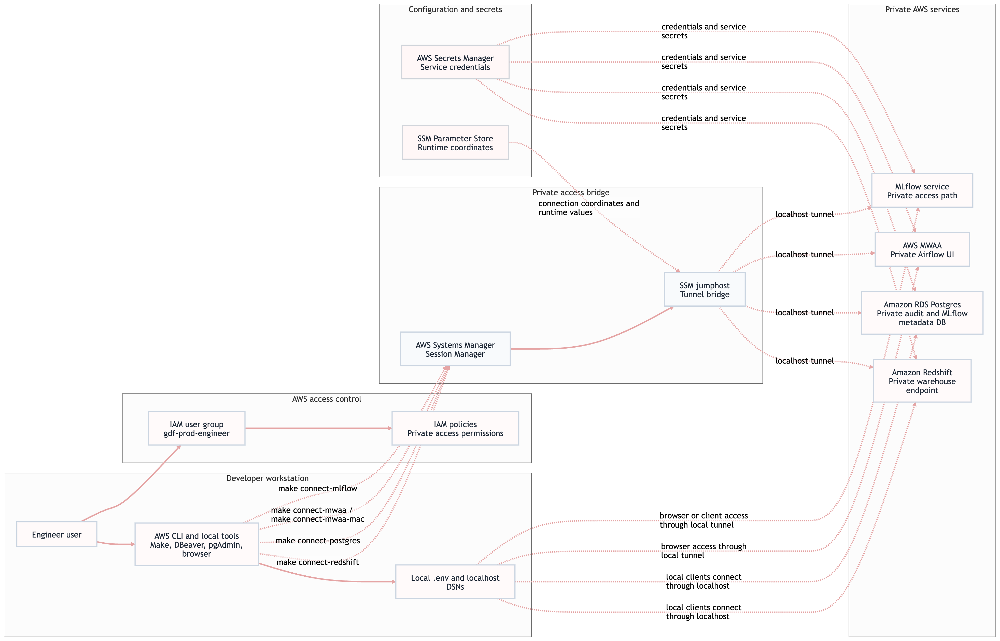
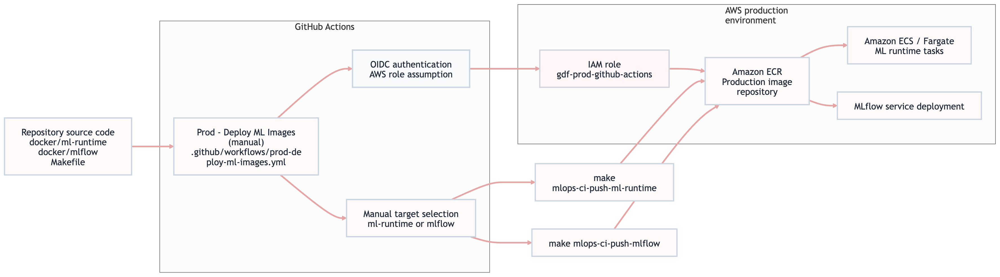

# Global Demand Forecasting Platform

Production-grade AWS data platform, warehouse, MLOps, and forecast application for retail demand forecasting.

The repository contains the implemented platform. It covers the full path from raw source ingestion to warehouse transformation, model training, batch forecasting, forecast writeback, and snapshot-based application delivery.



## 📖 Contents

- [📌 What this project is](#-what-this-project-is)
- [📌 Current status](#-current-status)
- [🧱 Platform at a glance](#-platform-at-a-glance)
- [🗺️ Documentation map](#️-documentation-map)
- [🏗️ Infrastructure](#️-infrastructure)
- [🌊 Data platform](#-data-platform)
- [🤖 ML platform](#-ml-platform)
- [📊 Forecast application](#-forecast-application)
- [🚀 Live application](#-live-application)
- [⚙️ Developer quickstart](#️-developer-quickstart)
- [🗂️ Repository structure](#️-repository-structure)
- [🧭 Operating principles](#-operating-principles)
- [📄 License](#-license)
- [👤 Author and contact](#-author-and-contact)
- [🌐 Data sources and APIs](#-data-sources-and-apis)
- [🔗 References](#-references)

## 📌 What this project is

The Global Demand Forecasting Platform is an end-to-end batch forecasting system built on AWS.

It ingests source data, lands raw datasets in Bronze storage, validates them, loads them into Redshift, builds curated dbt models, exports production training extracts, trains and registers models through MLflow, runs ECS-based batch prediction, writes forecasts back to the warehouse, and serves a separate snapshot-based forecast application.



## 📌 Current status

**Project status: complete**

Implemented and working:

- AWS infrastructure provisioned through Terraform
- private network access model with tunnel-based developer access
- Bronze, staging, Silver, and Gold warehouse flow
- source ingestion pipelines for M5, weather, macro, and trends
- data quality checks with audit logging
- Redshift warehouse and dbt transformations
- RDS Postgres operational metadata store
- Alembic-managed audit schema
- MWAA orchestration
- ECS-based ML runtime
- MLflow tracking and model registry
- production training extract export
- LightGBM production training workflow
- batch prediction for the next 28 days
- forecast writeback to the warehouse
- warehouse monitoring views for forecast runs and forecast freshness
- snapshot export for the forecast application
- snapshot-based Streamlit application with S3-first and local-cache fallback
- MWAA deployment workflow
- ML image deployment workflow

## 🧱 Platform at a glance

The platform is organized into four major operating areas.

### Infrastructure

The infrastructure layer provides the private AWS foundation for the platform.

It includes:

- IAM and GitHub OIDC access
- VPC and private networking
- SSM jumphost access path
- S3 object storage and data lake foundation
- RDS Postgres
- Redshift
- ECR
- ECS ML runtime
- MLflow service
- MWAA
- monitoring support

### Modern High Level Infrastructure and IaC Architecture 



Read the full infrastructure documentation here:

- [Infrastructure](docs/infrastructure.md)

### Data platform

The data platform is the batch data foundation of the project.

It is responsible for:

- source access and ingestion
- Bronze landing in S3
- ingestion audit logging
- data quality validation
- DQ audit logging
- Redshift staging loads
- dbt Silver builds
- dbt Gold builds
- curated warehouse outputs for downstream ML

Implemented source families:

- M5 retail demand data
- weather data
- macroeconomic data from FRED
- search trends data from Google Trends





Read the full data-platform documentation here:

- [Data platform](docs/data-platform.md)

### ML platform

The ML platform starts from curated Gold warehouse outputs.

It is responsible for:

- exporting the production training extract from Redshift to S3
- running ECS-based training
- recording runs and model registration in MLflow
- loading the latest registered production model
- generating the next 28 days of forecasts
- writing forecasts back to the warehouse
- exposing forecast monitoring and freshness outputs in the warehouse

The current production feature set is based on:

- `calendar_lag_rolling_baseline`

The training and prediction workflow is orchestrated by MWAA and executed on ECS / Fargate.





Read the full ML-platform documentation here:

- [ML platform](docs/ml-platform.md)

### Forecast application

The forecast application is a separate presentation layer.

It does not perform live training or live inference. It reads published forecast snapshots.

The implemented behavior is:

- snapshot export reads the warehouse forecast outputs
- the latest snapshot is published to S3
- versioned snapshot history is retained in S3
- a local cache is written for fallback
- the Streamlit application reads S3 first, then local cache



The forecast application setup and run path is referenced through the quickstart and platform documents.

## 🗺️ Documentation map

The core project documentation is intentionally kept small and focused.

- [Developer quickstart](docs/developer-quickstart.md)
- [Infrastructure](docs/infrastructure.md)
- [Data platform](docs/data-platform.md)
- [ML platform](docs/ml-platform.md)

## 🏗️ Infrastructure

The infrastructure is managed as code with Terraform under `infra/terraform/`.

It is split into:

- `bootstrap/` for Terraform backend setup
- `envs/` for environment-specific stacks
- `modules/` for reusable service modules
- `bin/` for connectivity and maintenance helpers

The production stack layout includes:

- IAM
- network
- SSM jumphost
- S3
- RDS Postgres
- Redshift
- ECR
- ECS ML runtime
- MLflow
- MWAA
- monitoring

The platform is private by design for core services such as Redshift, RDS Postgres, MWAA, and MLflow.

Developer access uses the tunnel-based commands exposed by the root `Makefile`, including:

- `make connect-redshift`
- `make connect-postgres`
- `make connect-mwaa`
- `make connect-mwaa-mac`
- `make connect-mlflow`

### Private Access and Security Model


For the complete infrastructure setup, deployment order, update flow, and destroy workflow, use:

- [Infrastructure](docs/infrastructure.md)

## 🌊 Data platform

The data platform uses S3 as the Bronze landing layer and Redshift as the warehouse execution layer.

The main end-to-end MWAA DAG is:

- `orchestration/airflow/dags/10_m5_full_refresh_mwaa.py`

At a high level, it runs:

1. M5 ingestion to Bronze
2. M5 core data quality checks
3. M5 core staging loads
4. weather ingestion, validation, and staging
5. macro ingestion, validation, and staging
6. trends ingestion, validation, and staging
7. dbt Silver build and test
8. dbt Gold build and test

Operational audit writes for ingestion and DQ go to the audit schema in RDS Postgres.

The data platform depends on:

- valid source credentials
- deployed infrastructure
- audit tables existing in Postgres
- MWAA startup config being current
- the project wheel being available to MWAA


For source setup, audit migration, local run flow, MWAA run flow, and data-platform CI/CD, use:

- [Data platform](docs/data-platform.md)

## 🤖 ML platform

The ML platform is orchestrated by MWAA and executed through ECS / Fargate.

The production workflow is split into three DAGs:

- `20_export_training_extract_ecs`
- `21_train_lightgbm_ecs`
- `22_predict_next_28_days_ecs`

Those DAGs perform the following sequence:

1. export the production training extract from Redshift to S3
2. train the production LightGBM model
3. record artifacts and model registration in MLflow
4. load the latest registered production model
5. generate the next 28 days of forecasts
6. write the forecast horizon back to the warehouse

The training extract is intentionally bounded for production stability.

The feature engineering layer contains multiple experiment families, but the approved production feature set is:

- `calendar_lag_rolling_baseline`

That production feature set combines:

- calendar-derived features
- lag features
- rolling mean features

The broader external-source feature families were tested, but they did not improve production performance for this forecasting setup and therefore were not adopted as the production feature contract.

Warehouse monitoring outputs include:

- forecast run monitoring
- latest forecast freshness


### MLOps and image delivery

The platform has a separate production image deployment path for:

- the ECS ML runtime image
- the MLflow image

### ML Image CI/CD Flow



The manual GitHub workflow is:

- `.github/workflows/prod-deploy-ml-images.yml`

This workflow is used to build and push either:

- `ml-runtime`
- `mlflow`

to ECR in a controlled production deployment flow.


For the full ML workflow, feature-set rationale, local workflow, ECS runtime model, and image CI/CD path, use:

- [ML platform](docs/ml-platform.md)

## 📊 Forecast application

The forecast application is intentionally separated from the live ML runtime path.

It depends on the warehouse forecast outputs already existing.

The expected production order is:

1. run the data platform
2. run the ML platform
3. export the latest forecast snapshot
4. run the Streamlit application

The local snapshot export command is:

```bash
make export-forecast-app-snapshot
```

The local application command is:

```bash
streamlit run forecast_app/app.py
```

Current snapshot behavior:

* latest snapshot from S3 first
* local cache second
* unavailable or empty state if neither exists

This application layer is intentionally decoupled from direct live warehouse serving at runtime.

### Modern High Level Forecast Application Architecture


## 🚀 Live application

The public forecast application is live here:

- [Global Demand Forecasting Platform](https://global-demand-forecasting-platform.streamlit.app/)

This deployed application reads published forecast snapshots from S3 and does not require direct live warehouse access from the public interface.


## ⚙️ Developer quickstart

The quickest path for a developer is:

1. install the required tools
2. configure AWS access
3. clone the repository
4. create `.venv` and `.venv-dbt`
5. create `.env`
6. make sure infrastructure access is in place
7. open private service tunnels
8. run Alembic migrations for the audit database
9. upload MWAA runtime artifacts
10. run the data platform
11. run the ML platform
12. export the application snapshot and run Streamlit

Use the quickstart here:

* [Developer quickstart](docs/developer-quickstart.md)


## 🗂️ Repository structure

```text
.
├── alembic/                  # audit schema migrations
├── app_config/               # shared application configuration
├── audit_log/                # ingestion and DQ audit logging
├── database/                 # SQLAlchemy engines and ORM models
├── ingestion/                # source ingestion logic and Bronze helpers
├── quality/                  # data quality checks
├── warehouse/                # Redshift loaders and dbt project
├── training/                 # training, validation, inference, and writeback
├── forecast_app/             # snapshot-based Streamlit application
├── orchestration/airflow/    # MWAA DAGs, plugins, startup, runtime packaging
├── infra/terraform/          # Terraform infrastructure code
├── docker/                   # runtime container definitions
├── .github/workflows/        # CI/CD workflows
└── docs/                     # project documentation
```

## 🧭 Operating principles

The operating rules of this repository are:

* batch ingestion, not streaming ingestion
* S3 Bronze plus Redshift warehouse, not a separate live serving store
* MWAA orchestrates, ECS computes
* MLflow tracks and registers models
* forecasts are written back to the warehouse
* the application serves snapshots, not live inference
* infrastructure, data platform, ML platform, and developer workflow are documented separately and referenced cleanly


## 📄 License

This project is released under the Apache License 2.0.

See the full license text in:

- [LICENSE.txt](LICENSE.txt)


## 👤 Author and contact

Created by **Bassey Akom**.

Connect here:

- [LinkedIn](https://www.linkedin.com/in/basseyakom/)
- [GitHub](https://github.com/Baci-Ak)


## 🌐 Data sources and APIs

The platform currently uses the following external data sources and source-access APIs.

These links are the easiest starting point if you want to reuse the same source pattern in your own project or adapt the architecture for a similar workflow system.

### M5 retail demand dataset

The retail demand baseline used in this project comes from the M5 Forecasting dataset on Kaggle.

- [Kaggle M5 competition overview](https://www.kaggle.com/competitions/m5-forecasting-accuracy)
- [Kaggle API documentation](https://www.kaggle.com/docs/api)

### Weather data

Historical weather inputs are sourced through Open-Meteo.

- [Open-Meteo historical weather API](https://open-meteo.com/en/docs/historical-weather-api)

### Macroeconomic data

Macroeconomic series are sourced from FRED.

- [FRED API overview](https://fred.stlouisfed.org/docs/api/fred/)
- [FRED API key documentation](https://fred.stlouisfed.org/docs/api/api_key.html)

### Search trends data

Search trend inputs are sourced from Google Trends access patterns.

- [Google Trends](https://trends.google.com/)
- [Pytrends project](https://github.com/GeneralMills/pytrends)


## 🔗 References

Official documentation for the main technologies used in this project:

- [dbt documentation](https://docs.getdbt.com/)
- [Alembic documentation](https://alembic.sqlalchemy.org/)
- [Terraform documentation](https://developer.hashicorp.com/terraform/docs)
- [MLflow documentation](https://mlflow.org/docs/latest/)
- [Streamlit documentation](https://docs.streamlit.io/)
- [Amazon MWAA documentation](https://docs.aws.amazon.com/mwaa/)
- [Amazon Redshift documentation](https://docs.aws.amazon.com/redshift/)
- [Amazon ECS documentation](https://docs.aws.amazon.com/ecs/)
- [AWS Secrets Manager documentation](https://docs.aws.amazon.com/secretsmanager/)
- [AWS Systems Manager documentation](https://docs.aws.amazon.com/systems-manager/)
